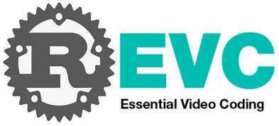

#  [](https://github.com/revcx/revc/actions) 

The fastest and safest EVC encoder and decoder

<details>
<summary><b>Table of Content</b></summary>

- [Overview](#overview)
- [Features](#features)
- [Roadmap](#roadmap)
- [Usage](#usage)
  - [Compressing video](#compressing-video)
  - [Decompressing video](#decompressing-video)
- [Contributing](#contributing)
</details>

## Overview
MPEG-5 Essential Video Coding (EVC) baseline profile is royalty-free. It includes only technologies that are more than 20 years old or that were submitted with a royalty-free declaration. 
Compared to H.264/AVC High Profile (JM19.0), MPEG-5 EVC Baseline Profile (ETM 6.1) provides about 30% BD-rate reduction with reduced encoding computation complexity and comparable decoding computation complexity.

REVC is a Rust-based EVC (baseline) video codec implementation.

## Features
* Coding Structure
  * Quad-tree based coding structure up to 64x64 block size
* Intra Prediction
  * DC, horizontal (H), vertical (V), diagonal left (DL), diagonal right (DR) for intra prediction
* Inter Prediction
  * Un-directional and Bi-directional inter prediction
  * Temporal direct mode
  * Three spatial neighbouring motion vectors and one temporally co-located motion vector
  * 1/2 and 1/4-pel interpolation
* Transform and Quantization
  * 4x4 to 64x64 DCT
  * QP range: 0 to 51
  * Run/level symbols with zig-zag scan
* Loop Filter
  * Deblocking filter in H.263 Annex J
* Entropy Coding
  * Binary arithmetic coding scheme in JPEG Annex D

## Roadmap
- [x] 0.1 Translation:
  - [x] Translate ETM baseline decoder from C to Rust
  - [x] Translate ETM baseline encoder from C to Rust		 
- [ ] 0.2 Optimization:
  - [ ] profiling and benchmarking
  - [ ] rust safe code optimization
  - [ ] assembly optimization
    - [ ] armeabi-v7a
    - [ ] arm64-v8a
    - [ ] x86
    - [ ] x86_64  
  - [ ] multi-threading optimization
- [ ] 0.3 Modernization
  - [ ] rate control
  - [ ] practical usecases: RTC, Live Streaming, VOD, etc


## Usage
### Compressing video
Input videos can be in raw yuv (I420) format or [y4m format](https://wiki.multimedia.cx/index.php/YUV4MPEG2). The monochrome color format is not supported yet.

```sh
cargo run --release --bin revce -- -i scripts/foreman_qcif8.yuv -w 176 -h 144 -z 30 -f 8 -q 27 -r scripts/tmp/rec.yuv --keyint 8 --ref_pic_gap_length 8 --skip 0 --disable_dbf --inter_slice_type 1 -o scripts/tmp/test_ld_p.evc -v
cargo run --release --bin revce -- -i scripts/foreman_qcif8.y4m                     -f 8 -q 27 -r scripts/tmp/rec.y4m --keyint 8 --ref_pic_gap_length 8 --skip 0               --inter_slice_type 0 -o scripts/tmp/test_ld_b.evc -v
```

### Decompressing video
Decoder only supports MPEG-5 EVC baseline profile. Output videos can be in raw yuv (I420) format or [y4m format](https://wiki.multimedia.cx/index.php/YUV4MPEG2)

```sh
cargo run --release --bin revcd -- -i scripts/tmp/test_ld_p.evc -o scripts/tmp/test.yuv -v
cargo run --release --bin revcd -- -i scripts/tmp/test_ld_b.evc -o scripts/tmp/test.y4m -v
```


## Contributing
Contributors or Pull Requests are Welcome!!!
